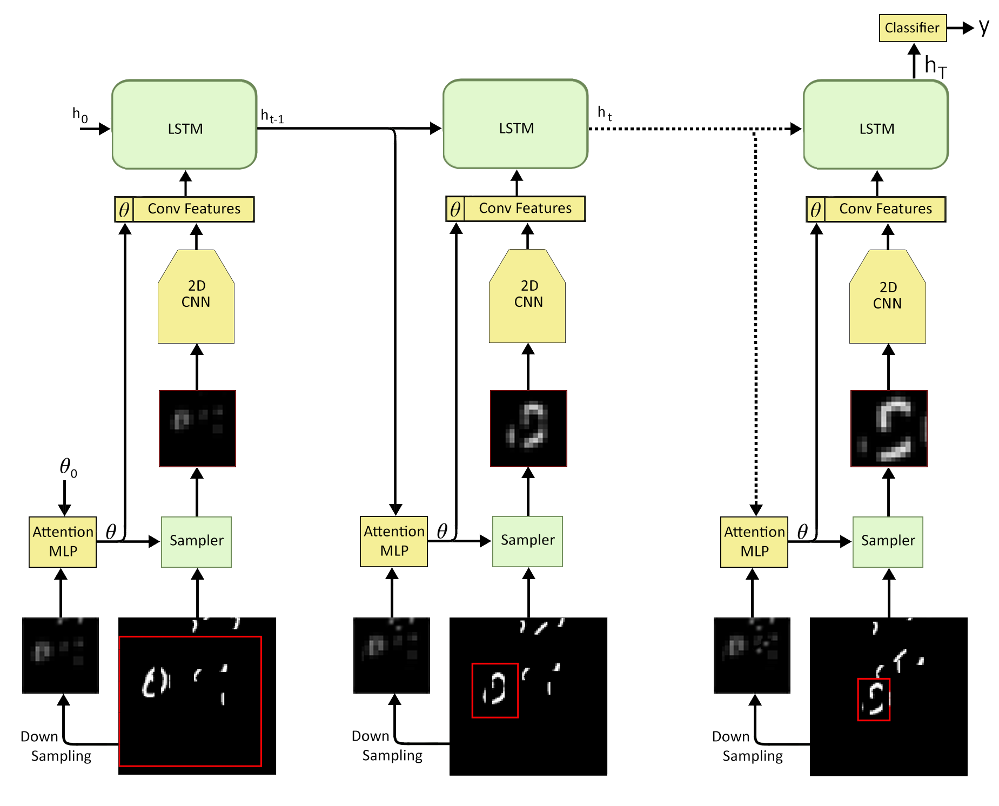
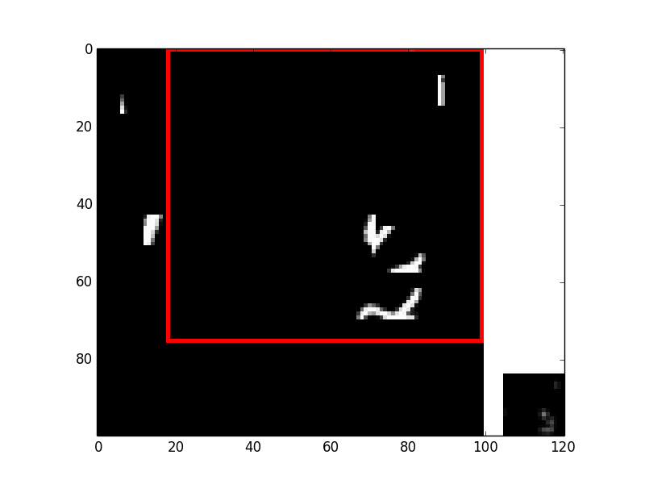
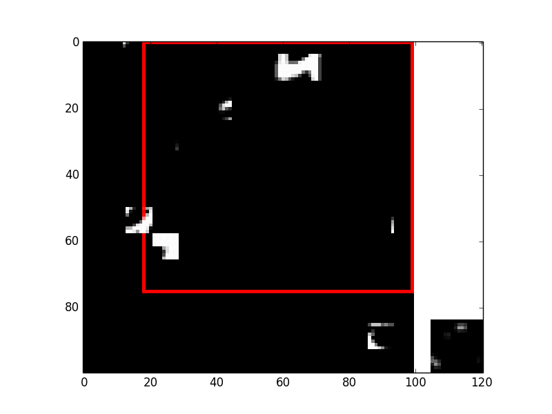
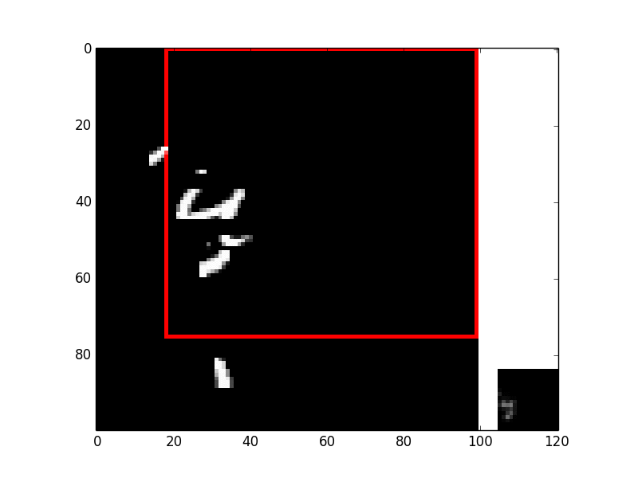

# LSTM-Attention on videos
This repository was built in October 2015 mainly in [Blocks](https://arxiv.org/abs/1506.00619) (Theano-based Framework developed in MILA by Bart Van Merriënboer et al.)
The code is not maintained and the work is not presented in any conferences/workshops or arXived. (We don't have any plan to arXiv or submit this work)

# Approach
Attention models have shown successful outputs on images. This work explores visual attention models on videos via employing a differentiable attention mechanism to apply a two-dimensional convolutional neural network on salient regions of consecutive frames with varying resolutions.
The goal of the work is to do video classification. This is a very short summary of the model.

# Synthetic MNIST-Cluttered-bar dataset
This toy dataset is not much different with cluttered MNIST video dataset and we just added some bars on the frames to make sure it is hard to recognize the digit from a few frames.

# Real dataset:
We tried our approach on the MPII Cooking dataset. It (the attention cropper) was overfitting on people cloths, and was failed to learn useful information for the classification.

# The architecture:

# Some visual results

Miss-classified to `1`!

# Interesting papers about attention
Many interesting papers were released on attention and particularly in "attention in videos". 
Here there are two sample papers on action classification in videos by employing attention:

Spatio-Temporal attention:
[Action Recognition using Visual Attention](https://arxiv.org/abs/1511.04119)

Temporal attention:
[End-to-end learning of action detection from frame glimpses in videos](https://www.cv-foundation.org/openaccess/content_cvpr_2016/papers/Yeung_End-To-End_Learning_of_CVPR_2016_paper.pdf)
 
